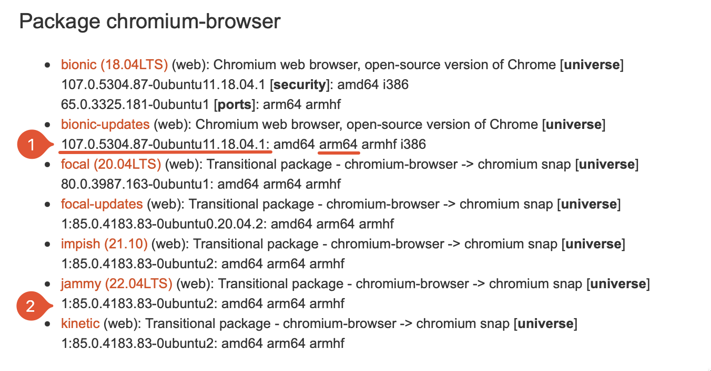

Selenoid is a powerful Golang implementation of original Selenium hub code. 
It is using Docker to launch browsers.[^1]

## Problem overview

Selenoid provides [Chrome browser images](https://aerokube.com/images/latest/#_chrome),
but they are available only for `linux/amd64` architecture. If you try to use that images
on Mac M1 it will use an emulation to support different architecture and it will be much
slower than it can be.


Fortunately, *sskorol* already implemented [Initial Chromium image support for arm64 #524](https://github.com/aerokube/images/pull/524).

You may ask *why Chromium and not Chrome*? And the answer is because Selenoid images are
base on Ubuntu images. But Google does not provide Chrome ARM64 for Linux. There's only 
Chromium is available for ARM64 Linux distributions.

Next, you may ask *why this image is based on Ubuntu 18.04*? I don't have an answer why 
an old LTS Ubuntu 18.04 receives the latest Chromium updates and new LTS Ubuntu 22.04 does not.
But you can see it at [Ubuntu packages](https://packages.ubuntu.com/search?suite=bionic-updates&searchon=names&keywords=chromium)



1. That's Chromium package that we need
2. The latest Chromium version in Ubuntu jammy (22.04 LTS) is 85.0. It does not have updates.

You may ask maybe someone already have built an appropriate image for Selenoid? Unfortunately,
earlier mentioned *sskorol* has built an image only for [chromium 100.0](https://hub.docker.com/r/sskorol/selenoid_chromium_vnc/tags).

So, we are supposed to build a Docker image ourselves.

## Docker image generation

**Prerequisites:**
1. You need installed Go: `brew install go`
2. You need installed Maven (to run tests on built image): `brew install mvn` or `sdk install maven`

First, clone [Selenoid Browser images repo](https://github.com/aerokube/images.git):
```shell
$ git clone https://github.com/aerokube/images.git selenoid-images
$ cd selenoid-images
```

Then build Chromium images using the following command:
```shell
$ ./build-chromium.sh 107.0.5304.87-0ubuntu11.18.04.1 chromium_107.0 7.4.0
```
where:

- `107.0.5304.87-0ubuntu11.18.04.1` is actual Chromium Ubuntu package version from [Ubuntu packages](https://packages.ubuntu.com/search?suite=bionic-updates&searchon=names&keywords=chromium);
- `chromium_107.0` is a tag for generated Docker image. The whole image name will be `selenoid/vnc:chromium_107.0`;
- `7.4.0` is base image tag. Base image also builds with a script. Base image version for chromium image generation
  can be found at `static/chromium/local/Dockerfile`.

After executing that command `selenoid/vnc:chromium_107.0` should be generated. All tests should pass. 

**Tip:**<br/>
If some tests fail, try to clean your Docker (remove all containers and delete all selenoid related images).


## Pushing Docker image and usage with Selenoid

You can tag generated Docker image and push to your private/personal registry:
```shell
$ docker tag selenoid/vnc:chromium_107.0 xandrcherepanov/selenoid_vnc:chromium_107.0
$ docker push xandrcherepanov/selenoid_vnc:chromium_107.0
```

Now we can use our image in `browsers.json` like:
```json
{
  "chrome": {
    "default": "107.0",
    "versions": {
      "107.0": {
        "image": "xandrcherepanov/selenoid_vnc:chromium_107.0",
        "port": "4444",
        "cpu": "1.0"
      }
    }
  }
}
```

[^1]: <https://aerokube.com/selenoid/latest/>
