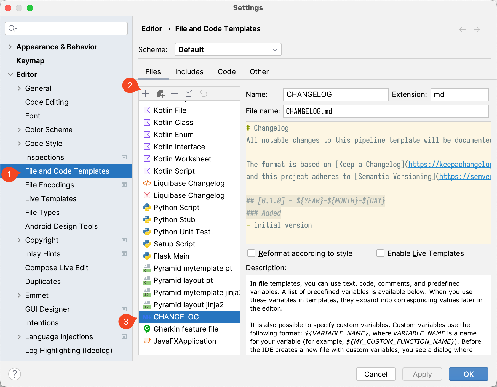

There is a good practice to maintain a changelog file for a project. One of the most used templates for 
`CHANGELOG.md` is described on [keepachangelog.com](https://keepachangelog.com/en/1.1.0/).

If you're using IntelliJ IDEA or other JetBrains IDE, you can generate a new `CHANGELOG.md` using _File and Code
Templates_ feature.



It's using [Apache Velocity](https://velocity.apache.org/engine/devel/user-guide.html#Velocity_Template_Language_VTL:_An_Introduction) templating language.
And if you are pasting changelog's markdown template as is, generated file will be like this:

```markdown {hl_lines=["6-7"]}
# Changelog
All notable changes to this pipeline template will be documented in this file.

The format is based on [Keep a Changelog](https://keepachangelog.com/en/1.0.0/),
and this project adheres to [Semantic Versioning](https://semver.org/spec/v2.0.0.html).

- initial version
```

Apache Velocity ignores 2nd and 3rd level headers. The problem is that strings starting with double hash
(##) are used as [comments](https://velocity.apache.org/engine/devel/user-guide.html#comments) by Velocity templating.

### Escaping attempt

Trying to use [escaping VTL references](https://velocity.apache.org/engine/devel/user-guide.html#escaping-valid-vtl-references) 
with `\` character actually does not help. For example, escaping like this:
```markdown {hl_lines=["1-2"],linenostart=6}
\## [0.1.0] - ${YEAR}-${MONTH}-${DAY}
\### Added
- initial version
```
will generate the following content for the file:
```markdown {hl_lines=[1],linenostart=6}
\\- initial version
```

### Solution

For generating correct markdown, you can assign hash sign (`#`) to a variable and then use it in the 
Velocity template.

```markdown {hl_lines=[1,"8-9"]}
#set($hash = '#')## Assign a hash (#) character to a variable
# Changelog
All notable changes to this pipeline template will be documented in this file.

The format is based on [Keep a Changelog](https://keepachangelog.com/en/1.0.0/),
and this project adheres to [Semantic Versioning](https://semver.org/spec/v2.0.0.html).

${hash}${hash} [0.1.0] - ${YEAR}-${MONTH}-${DAY}
${hash}${hash}${hash} Added
- initial version
```